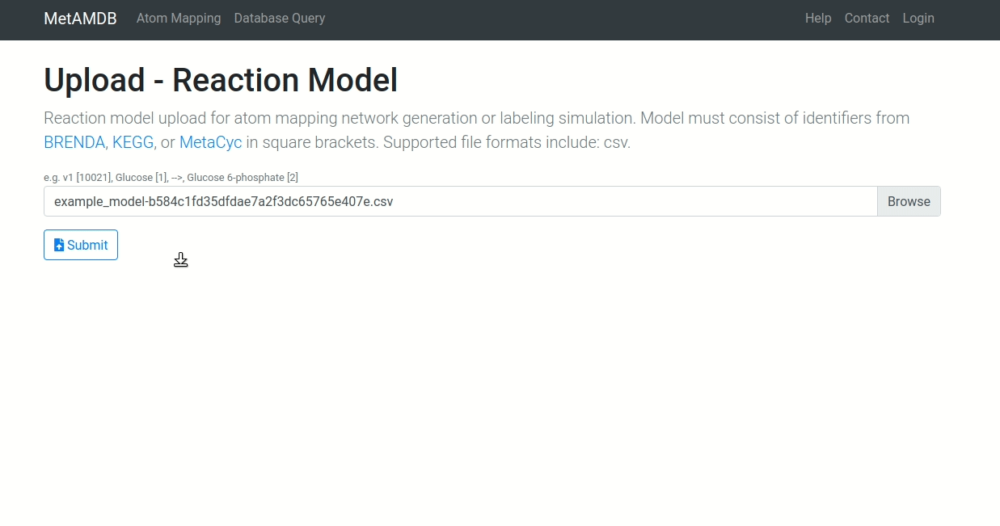

# Atom Mapping Model

Uploaded user metabolic models are displayed in as atom mapping models. The features of said atom mapping model will be described in the following sections.

## Table Format
The atom mapping table is divided in the following six columns:
- [Atom Mapping](/metamdb-docs/atom-mapping-model#atom-mapping)
- [Identifier](/metamdb-docs/atom-mapping-model#identifier)
- [Name](/metamdb-docs/atom-mapping-model#name)
- [Substrates](/metamdb-docs/atom-mapping-model#substrates)
- [Products](/metamdb-docs/atom-mapping-model#products)
- [Curated](/metamdb-docs/atom-mapping-model#curated)

### Atom Mapping
The atom mapping is accessible with the plus "+" button. Clicking the button of a specific reaction opens only that atom mapping. Clicking the button in the columns names row opens all atom mappings. Clicking an opened button closes the mapping again.

Each atom mapping consists of a row per metabolite. The first column shows the metabolite identifier, the second column the metabolite name, the third column the atom mapping in the abc-format (for now only carbon), and lastly the fourth column contains reactant information. Fields with a text box (such as the atom mapping field) can be changed if necessary.

### Identifier
The identifier columns displays a [Reaction](/metamdb-docs/reaction) link. If no reaction identifier was given or none was found the field is empty. The table can be sorted by identifier.

### Name
The column field shows the given reaction name. The field is editable by double clicking on the name. The table can also be sorted by name.

### Substrates
The substrates column shows all the given substrate metabolites quantity and names. Additionally if a metabolite id was identified a link to the [Metabolite](/metamdb-docs/metabolite) page will be established.

### Products
Products effectively function like [Substrates](/metamdb-docs/atom-mapping-model#substrates).

### Curated
The curated column indicates the atom mapping status:
- :heavy_check_mark: Manually curated
- :x: Automatically generated
- :bust_in_silhouette: User-provided

The table can be sorted by curation status by clicking on the arrow button.