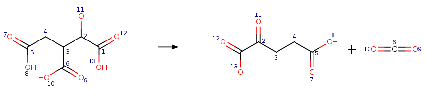

# Reaction Image
Reaction Images are visual representations of [RXN Files](/metamdb-docs/rxn-file) that allow users to follow atom mappings easier. Depicted in each image are substrates, a reaction arrow, and products. The mapping can be followed from the substrate side to the products by following the numbers next to each atom.

