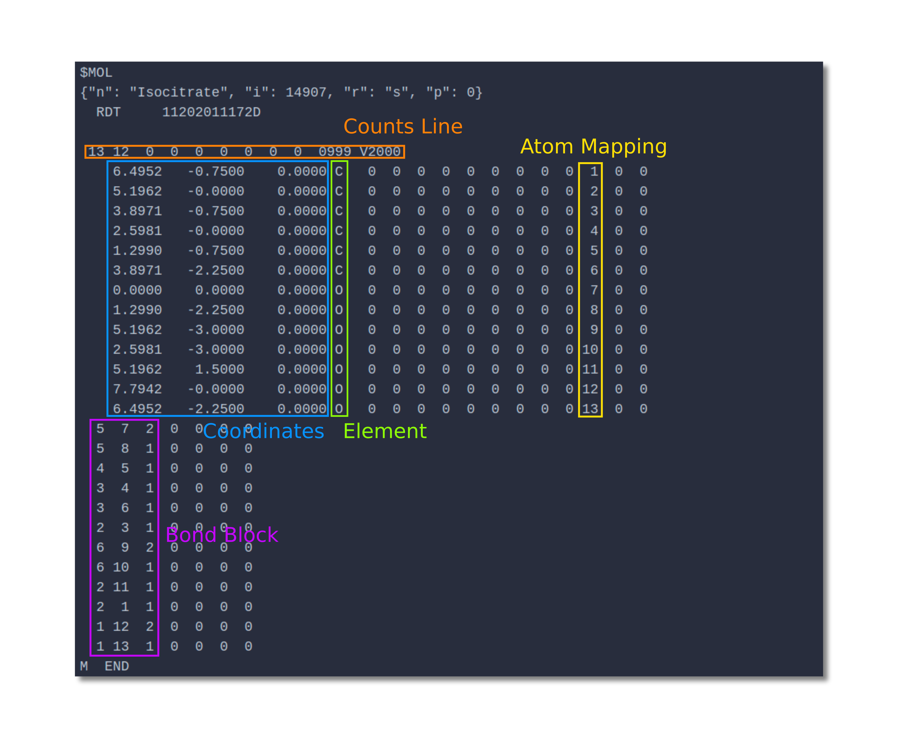

import Tabs from '@theme/Tabs';
import TabItem from '@theme/TabItem';
# RXN Files
RXN Files are part of the MDL Information Systems [:link: Chemical Table Files](https://en.wikipedia.org/wiki/Chemical_table_file) which also include Molfiles. Each RXN File contains a RXN specific comment block at the beginning and following that multiple MOL blocks depending on the number of metabolites.

<Tabs
  defaultValue="comment-block"
  values={[
    {label: 'Comment Block', value: 'comment-block'},
    {label: 'MOL Block', value: 'mol-block'},
    {label: 'Full RXN', value: 'full-rxn'},
  ]}>

  <TabItem value="comment-block">

Each Comment Block starts with `$RXN` marking the beginning of a RXN File. The following line contains a comment that is specific to the program generating the RXN File. The last line indicates the number of substrates and products respectively.

  

</TabItem>

  <TabItem value="mol-block">

Each MOL Block starts with an indicator `$MOL`, which is followed by a comment block containing name, MetAMDB identifier, reactant and position, as well as a comment by the program used for atom mapping generation. 

Indicated in orange is the counts lines, showing the number of atoms, the number of bonds and the MOL file format `V2000`.

Followed by the counts line is the atom block, containing x, y, and z coordinates used for the [Reaction Image](/metamdb-docs/reaction-image) generation (blue), the element (green), and finally the atom mapping (yellow).

After the atom block comes the bond block, which shows the atoms which are participating in the bond and the bond type (1=single bond, 2=double bond). So for example atom 5 and 7 are bound by a double bond.

:::caution Warning!
Atom numbers are row numbers of the atom block, not the atom mapping number. This is only essential if the row number is unequal to the atom mapping number.
:::
  

</TabItem>
  <TabItem value="full-rxn">

```rxn title="/mappings/rxn/idh.rxn"
$RXN

  EC-BLAST     635

  1  2
$MOL
{"n": "Isocitrate", "i": 14907, "r": "s", "p": 0}
  RDT     11202011172D

 13 12  0  0  0  0  0  0  0  0999 V2000
    6.4952   -0.7500    0.0000 C   0  0  0  0  0  0  0  0  0  1  0  0
    5.1962   -0.0000    0.0000 C   0  0  0  0  0  0  0  0  0  2  0  0
    3.8971   -0.7500    0.0000 C   0  0  0  0  0  0  0  0  0  3  0  0
    2.5981   -0.0000    0.0000 C   0  0  0  0  0  0  0  0  0  4  0  0
    1.2990   -0.7500    0.0000 C   0  0  0  0  0  0  0  0  0  5  0  0
    3.8971   -2.2500    0.0000 C   0  0  0  0  0  0  0  0  0  6  0  0
    0.0000    0.0000    0.0000 O   0  0  0  0  0  0  0  0  0  7  0  0
    1.2990   -2.2500    0.0000 O   0  0  0  0  0  0  0  0  0  8  0  0
    5.1962   -3.0000    0.0000 O   0  0  0  0  0  0  0  0  0  9  0  0
    2.5981   -3.0000    0.0000 O   0  0  0  0  0  0  0  0  0 10  0  0
    5.1962    1.5000    0.0000 O   0  0  0  0  0  0  0  0  0 11  0  0
    7.7942   -0.0000    0.0000 O   0  0  0  0  0  0  0  0  0 12  0  0
    6.4952   -2.2500    0.0000 O   0  0  0  0  0  0  0  0  0 13  0  0
  5  7  2  0  0  0  0 
  5  8  1  0  0  0  0 
  4  5  1  0  0  0  0 
  3  4  1  0  0  0  0 
  3  6  1  0  0  0  0 
  2  3  1  0  0  0  0 
  6  9  2  0  0  0  0 
  6 10  1  0  0  0  0 
  2 11  1  0  0  0  0 
  2  1  1  0  0  0  0 
  1 12  2  0  0  0  0 
  1 13  1  0  0  0  0 
M  END
$MOL
{"n": "2-oxoglutarate", "i": 25783, "r": "p", "p": 1}
  RDT     11202011172D

 10  9  0  0  0  0  0  0  0  0999 V2000
    1.2990   -0.7500    0.0000 C   0  0  0  0  0  0  0  0  0  1  0  0
    2.5981   -0.0000    0.0000 C   0  0  0  0  0  0  0  0  0  2  0  0
    3.8971   -0.7500    0.0000 C   0  0  0  0  0  0  0  0  0  3  0  0
    5.1962   -0.0000    0.0000 C   0  0  0  0  0  0  0  0  0  4  0  0
    6.4952   -0.7500    0.0000 C   0  0  0  0  0  0  0  0  0  5  0  0
    6.4952   -2.2500    0.0000 O   0  0  0  0  0  0  0  0  0  7  0  0
    7.7942   -0.0000    0.0000 O   0  0  0  0  0  0  0  0  0  8  0  0
    2.5981    1.5000    0.0000 O   0  0  0  0  0  0  0  0  0 11  0  0
    0.0000    0.0000    0.0000 O   0  0  0  0  0  0  0  0  0 12  0  0
    1.2990   -2.2500    0.0000 O   0  0  0  0  0  0  0  0  0 13  0  0
  5  6  2  0  0  0  0 
  5  7  1  0  0  0  0 
  4  5  1  0  0  0  0 
  3  4  1  0  0  0  0 
  2  3  1  0  0  0  0 
  2  8  2  0  0  0  0 
  1  2  1  0  0  0  0 
  1  9  2  0  0  0  0 
  1 10  1  0  0  0  0 
M  END
$MOL
{"n": "CO2", "i": 64158, "r": "p", "p": 2}
  RDT     11202011172D

  3  2  0  0  0  0  0  0  0  0999 V2000
    1.2990   -0.7500    0.0000 C   0  0  0  0  0  0  0  0  0  6  0  0
    2.7990   -0.7500    0.0000 O   0  0  0  0  0  0  0  0  0  9  0  0
   -0.2010   -0.7500    0.0000 O   0  0  0  0  0  0  0  0  0 10  0  0
  1  2  2  0  0  0  0 
  1  3  2  0  0  0  0 
M  END
```

</TabItem>
</Tabs>


